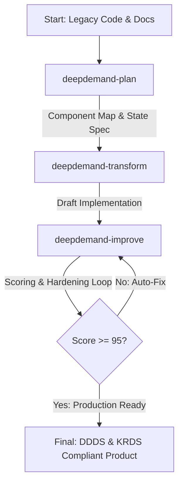

# DeepDemand Design System Codex Skill Bundle

이 디렉토리는 AI 에이전트 및 개발자 그룹이 (주)딥마인의 AI 미래 수요 예측 솔루션인 **DeepDemand**의 디자인 시스템(DDDS)을 기획, 마이그레이션(변환), 품질 고도화(개선)하기 위한 **Codex Skill Bundle** 명세서입니다.

이 스킬 번들은 [bytonylee/future-krds](https://github.com/bytonylee/future-krds)의 워크플로우 체계를 따르며, 대한민국의 디지털 정부 서비스 디자인 가이드라인(KRDS)을 B2B AI 엔터프라이즈 환경에 맞게 최적화하는 3단계 품질 루프를 정의합니다.

---

## 📂 스킬 구조 (Skill Architecture)

### 1. [deepdemand-plan](./deepdemand-plan/instructions.md)
*   **역할**: 신규 컴포넌트나 새로운 웹 뷰를 설계하기 전의 **기획 단계** 스킬.
*   **출력**: 화면 상태 정의서, 사용될 DDDS 및 KRDS 컴포넌트 매핑 테이블, 웹 접근성 검증 계획서.

### 2. [deepdemand-transform](./deepdemand-transform/instructions.md)
*   **역할**: 기존 레거시 코드(`App.jsx` 등)나 초안 디자인을 DDDS의 HSL 토큰 구조 및 에디토리얼 테마로 **자동 전환**하는 스킬.
*   **출력**: CSS 변수 바인딩이 적용되고, 접근성이 준수된 컴포넌트 코드로 마이그레이션된 소스코드.

### 3. [deepdemand-improve](./deepdemand-improve/instructions.md)
*   **역할**: 구현 완료 후 진행되는 **자동화 검증 및 수정(Hardening)** 스킬.
*   **출력**: 종합 점수 보고서(Score Sheet) 및 95점 이하 시 가이드라인에 따른 수정 패치 코드.

---

## 🚀 시작하기

이 스킬 번들은 AI 자율 프레임워크나 개발 그룹에서 컨텍스트 프롬프트로 주입받아 사용할 수 있습니다. 각 서브 디렉토리의 `instructions.md` 파일을 통해 각 단계별 상세 동작 프로토콜과 검증 규칙을 확인하십시오.

*   [기획 단계 지침서 (Plan)](./deepdemand-plan/instructions.md)
*   [전환 단계 지침서 (Transform)](./deepdemand-transform/instructions.md)
*   [품질 검증 단계 지침서 (Improve)](./deepdemand-improve/instructions.md)
